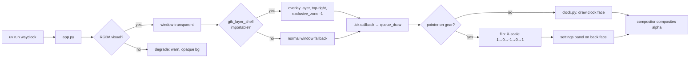

# wayclock — floating analog clock (Python + GTK, snap-packaged)

A small GTK application written in Python: a circular, high-quality analog
clock composited with per-pixel transparency so it appears to float over the
desktop. Packaged as a strict-confinement snap built with uv.

## 1. Acceptance criteria

- Circular clock face; every pixel outside the circle has alpha 0 — a true
  circle on any wallpaper/window, not a rounded rectangle.
- "Floating": no decorations, no taskbar entry, reserves no layout space,
  stays above other windows, clicks pass through. (Constraint for this box:
  see §2.1.)
- Accurate local time: hour/minute/second hands, 12 hour ticks, 60 minute
  ticks, antialiased, smooth-sweep second hand at vsync.
- Idle CPU ≈ 0; redraw only when the clock moves.
- Correct at HiDPI.
- Builds and runs as a strict-confinement snap on this machine.
- **Settings menu**: the Lucide `settings` icon (downloaded locally into
  `wayclock/assets/`, see §4.6) sits at the bottom center of the clock face;
  clicking it flips the clock over to a settings panel — same visual
  language as the clock. Exposes general styling + opacity controls that
  persist across runs.
- **Resizable**: the window can be resized by the compositor/user, but the
  aspect ratio is always locked square (the clock fills the square, any scale).
- **Persisted settings**: styling/opacity changes are saved to a file in a
  snap-writable path (see §4.6) and reloaded on next launch.

## 2. Environment facts (measured 2026-08-18)

| Fact | Value | Consequence |
|---|---|---|
| Compositor | GNOME Shell 46 / Mutter, native Wayland (`wayland-0`) | **No `zwlr_layer_shell_v1`** (verified by registry dump) — floating not possible client-side on this box |
| Python | 3.12.3, PyGObject 3.48.2, pycairo 1.25.1, gi cairo binding OK | Host has everything needed for dev |
| GTK | 3.24 **and** 4.14 installed | Both available; we choose GTK3 (see §9) |
| uv | 0.10.0 (`~/.local/bin/uv`) | Project/venv manager available, no install needed |
| Packaging | snapd + snapcraft present | Snap build + `snap install --dangerous` verifiable here |
| `gtk-layer-shell` | Python module absent; C lib apt-installable | Optional enhancement, see §4.2 |
| `grim` | not installed | Install via apt for the transparency proof (M2) |

### 2.1 The one hard constraint

"Floating" on Wayland = `zwlr_layer_shell_v1` (waybar, wlogout use it). Mutter
46 does not serve it, and no other client-side protocol on Mutter produces an
undecorated always-on-top surface. Decision:

- **Primary path**: `gtk-layer-shell` (Python) when available — floats on
  wlroots compositors (sway, labwc, river), Hyprland, KDE.
- **Fallback path**: normal GTK window (auto-selected). Still circular + fully
  transparent; only loses "floating" — this is what runs on this GNOME box.
- **Snap reality**: layer-shell is optional and off by default; the core app
  and snap must not depend on it.

## 3. Architecture

GTK replaces almost all the Wayland plumbing the C version needed. GLib's main
loop dispatches events; GDK owns the surface, buffers, damage, and HiDPI scale;
the **frame clock** (`Gtk.Window.add_tick_callback`) gives vsync pacing. We
write only: window setup (RGBA visual), one cairo draw function, one tick
callback. The settings panel is drawn on the same cairo canvas (a flip card),
so styling stays pixel-consistent with the clock — no themes or widgets. The
only asset in the app is the settings icon (see §4.6).

```
GLib main loop (GTK3)
   │
   └─ GdkFrameClock (vsync) ── tick callback
        │  time changed? → window.queue_draw()
        │  flipping?      → advance flip animation → queue_draw()
        ▼
   draw callback (DrawingArea::draw)
        │  cairo ctx (pycairo), X-scale flip transform
        ▼
   front (clock) OR back (settings) → compositor composites alpha
```

Buffers/surface: `wl_shm` handled by GDK (GTK3 Wayland backend). Alpha:
per-pixel from the RGBA visual; nothing drawn outside the circle → transparent
→ the desktop shows through. HiDPI: `window.get_scale_factor()` multiplies the
drawing buffer; cairo AA stays crisp.



## 4. Component design

### 4.1 Window & transparency (`app.py`)

- `Gtk.Window`, resizable, **always square** (aspect locked, see §4.7);
  default logical size e.g. 320 px.
- RGBA visual recipe (GTK3, battle-tested):
  ```python
  screen = window.get_screen()
  visual = screen.get_rgba_visual()
  if visual is None:        # compositor without ARGB — practically never on Wayland
      warn and use default
  window.set_visual(visual)
  window.set_app_paintable(True)
  ```
- Draw callback paints the window background with alpha 0 first — only the
  circle is visible; the window rectangle itself is invisible.
- No `set_decorated(False)` outside layer-shell mode (Mutter ignores it and
  it breaks the fallback on X11); layer-shell mode is undecorated by nature.
- Lifecycle: default GTK signal handling for SIGINT/SIGTERM; `Gtk.main()` loop.

### 4.2 Layer-shell — optional, runtime-detected

- `try: import gtk_layer_shell` (`pip install gtk-layer-shell` +
  `apt install libgtk-layer-shell0`); on `ImportError` → fallback window.
- When present:
  ```python
  gtk_layer_shell.init_for_window(win)
  gtk_layer_shell.set_layer(win, gtk_layer_shell.Layer.TOP)
  gtk_layer_shell.set_anchor(win, gtk_layer_shell.Edge.TOP | gtk_layer_shell.Edge.RIGHT)
  gtk_layer_shell.set_margin(win, 24)
  gtk_layer_shell.set_exclusive_zone(win, -1)      # floats, reserves nothing
  gtk_layer_shell.set_keyboard_mode(win, gtk_layer_shell.KeyboardMode.NONE)
  ```
  `KeyboardMode.NONE` keeps the surface from grabbing keys (the clock takes no
  keyboard input), and GTK still delivers pointer events to the surface where
  our gear/settings hit-testing runs.
- Outside the interactive gear/settings regions, the surface has no input
  handlers — pointer events there simply do nothing, preserving the
  "click-through" feel for everything else.
- Never required at build/run time.

### 4.3 Rendering (`clock.py`)

Pure function `draw_clock(ctx, size, now)` — cairo only, no GTK state,
testable against hand angles. Drawing order (same geometry as v1 plan):

1. **Soft shadow** — radial-gradient disk, low alpha, +3 px offset.
2. **Face** — radial gradient (near-white core → slightly darker edge),
   `alpha ≈ 0.92`, translucent.
3. **Rim** — 2 px ring: darker outer + lighter inner highlight.
4. **Ticks** — 60 minute ticks (short, ~30% alpha), 12 hour ticks (long,
   bold, ~90% alpha) drawn on top; `sin/cos` placement inside the rim.
5. **Hands** — `CAIRO_LINE_CAP_ROUND` strokes: hour 0.45R × 7 px,
   minute 0.60R × 5 px, second 0.72R × 2 px with 0.15R counterweight tail;
   faint offset shadow stroke under each. Center cap: base disc + accent disc.
6. Angles from local time (`datetime.now()`):
   - hour   = `(h % 12 + m/60 + s/3600) × 30°`
   - minute = `(m + s/60) × 6°`
   - second = `(s + µs/1e6) × 6°` → sub-degree resolution for the sweep.

Sizes/colors are module constants at the top of `clock.py` (single theme
point).

### 4.4 Pacing & CPU

- `window.add_tick_callback(...)` — GTK3 frame clock, fires per vsync.
- Callback reads the time; if the second-hand angle moved ≥ ~1 frame's worth
  since the last draw → `queue_draw()`; always return `True` (keep ticking).
- Result: smooth sweep at vsync, ~0 idle CPU (no redraw when nothing moved,
  no polling — the frame clock only fires on vsync).

### 4.5 Dev workflow (uv)

```sh
uv venv --system-site-packages .venv   # gi + pycairo resolve from host apt packages
uv pip install -e .                    # installs the wayclock package (no 3rd-party deps)
uv run wayclock                        # run against host Wayland session
```

- Decision: **`--system-site-packages` is required** — PyGObject (`gi`) and
  pycairo are system packages (apt `python3-gi`, `python3-gi-cairo`); they are
  not pip-installable without building GObject introspection against system
  libs, which is wrong inside a snap. The settings icon also needs
  `gir1.2-rsvg-2.0` (librsvg) on the host; the snap gets it from the gnome
  extension (verified present in `gnome-46-2404` rev 153). uv's role:
  reproducible venv + runner + lockfile discipline. `pyproject.toml` declares
  `requires-python >= 3.12` and **zero** third-party Python dependencies (the
  clock needs none; librsvg is a system lib, not a Python dep) — `uv.lock`
  stays trivial, but the venv is still the packaging unit for the snap.

### 4.6 Settings menu, gear, flip (`clock.py` + `settings.py`)

The settings panel is drawn on the **back face** of a flip card on the same
cairo canvas as the clock — fully on-brand, no GTK widgets, themes, or icons.

- **Settings icon** (decision: Lucide `settings`, not the Vanilla
  `p-icon--settings`): downloaded locally into `wayclock/assets/settings.svg`
  (official Lucide source, 24×24, MIT, stroke-based) and shipped with the
  package via `[tool.setuptools.package-data]`, so the running app never
  fetches anything. It sits at the clock's bottom center (6 o'clock):
  icon radius `0.16 × R` (`GEAR_FRAC`) centred `0.58 × R` below the clock
  centre (`GEAR_POS`), the only interactive region on the front face.
  Raised above the 6 o'clock tick and the ticks nudged outward (hour
  `0.78–0.92 R`, minute `0.85–0.92 R`) so the open-centred stroke icon and
  the tick keep a visible gap (the old solid gear simply hid the tick).
  - **Why Lucide over Vanilla**: requested by the user; the stroke-based cog
    matches the clock's thin-line rim/hand language better than Vanilla's
    filled glyph.
  - **Rendering**: the SVG keeps `stroke="currentColor"`; librsvg
    (`gi.repository.Rsvg`, part of the gnome-46-2404 SDK the snap already
    uses — verified, rev 153) rasterizes it into the cached face surface,
    one reused `Rsvg.Handle` with a per-render stylesheet
    (`* { color: rgba(r,g,b,a) }`) tinting it to the rim colour, so theme +
    opacity flow through exactly like every other element. No GTK widget,
    no extra snap parts.
- **Interaction**: the `DrawingArea` registers `BUTTON_PRESS_MASK` +
  `POINTER_MOTION_MASK` + `BUTTON_RELEASE_MASK`. A hit-test maps the pointer
  position to either the gear (front) or a control (back). In layer-shell
  mode, `KeyboardMode.NONE` is dropped so pointer events reach the surface;
  in the GNOME fallback a normal window receives them natively.
- **Flip**: GTK3 has no 3D transform, so the flip is a horizontal **X-scale
  animation** driven by the frame clock: scale 1→0 on the outgoing face,
  cross-fade at the midpoint, then 0→1 on the incoming face (sweep the
  `flip ∈ [-1,1]` scalar each tick, ~250 ms, ease-in-out). The draw callback
  applies `translate(cx,0) scale(|flip|,1) translate(-cx,0)` and picks the
  face by the sign of `flip`.
- **Controls** (drawn + hit-tested in cairo, same language as the clock):
  - **Opacity** — vertical slider (0.15–1.0) scaling the whole clock's alpha.
  - **Styling / theme** — swatch row: light / dark face preset (affects
    `FACE_CORE`/`FACE_EDGE`/`RIM_*` constants).
  - **Accent color** — small palette of swatches for the second hand
    (`HAND_SECOND`).
  - Back button (a "‹ clock" affordance) flips back.
- **Persistence — snap-writable path (required)**. On any change, settings
  are written as JSON to
  `$SNAP_USER_COMMON/settings.json` in the snap (writable in strict
  confinement, **shared across snap revisions** so refreshes keep user
  settings). Dev (non-snap) fallback:
  `$XDG_CONFIG_HOME/wayclock/settings.json` (default `~/.config/…`). Resolve
  at startup via
  `os.environ.get("SNAP_USER_COMMON") or os.path.join(os.environ.get("XDG_CONFIG_HOME", "~/.config"), "wayclock")`;
  load if present, save atomically (`write temp + os.replace`) on every
  control change. Defaults live in `settings.py` constants.

### 4.7 Resize & square aspect

- `win.set_resizable(True)`; the window may be resized freely by the user or
  compositor, but the content is always a square.
- Enforce with `Gtk.AspectFrame` (`ratio=1.0`, `obey_child=False`) wrapping
  the `DrawingArea`: GTK allocates the largest square that fits, centered.
- Rendering adapts to the current side length: `SIZE` becomes a runtime value
  taken from the allocation (clamped to a sane minimum, e.g. 64 px); the
  cached offscreen face (`_face_surface`) is rebuilt when the square side or
  the draw scale changes. All geometry in `clock.py` is already relative to
  `R = size/2`, so it scales without change.
- Layer-shell mode: set the surface size to the square too (wlroots
  `set_size`); on GNOME the normal window handles it natively.

```
wayclock/
  pyproject.toml            # uv project; [project.scripts] wayclock = wayclock.app:main
  uv.lock                   # generated
  src/wayclock/
    __init__.py
    app.py                  # window, RGBA visual, aspect frame, tick callback,
                            #   layer-shell hook, gear hit-test, flip state, main()
    clock.py                # draw_clock(ctx, size, now), gear + settings-face drawing
    settings.py             # defaults, JSON load/save ($SNAP_USER_COMMON), state
  snap/
    snapcraft.yaml
    local/launch            # snap entry: exec "$SNAP/venv/bin/python3" -m wayclock
```

## 6. Snap packaging

`snap/snapcraft.yaml` — base `core24`, confinement `strict`, one app:

```yaml
apps:
  wayclock:
    command: local/launch
    plugs: [wayland, desktop]
    environment:
      GDK_BACKEND: wayland
```

Parts:

1. **`python`** — `stage-packages` from the 24.04 archive (matches host
   versions): `python3`, `python3-gi`, `python3-gi-cairo`, `python3-cairo`
   (pycairo: `import cairo`), `gir1.2-gtk-3.0`. `libgtk-3-0`,
   `libgirepository-1.0-1`, and `libcairo2` arrive as their dependencies —
   no need to list them. The `gnome` extension provides the SDK (incl.
   librsvg for the settings icon, §4.6); the icon itself rides inside the
   wheel as package data — nothing else to stage.
2. **`wayclock`** — copies `wayclock/` into `$CRAFT_PRIME/wayclock` and
   `snap/local/launch`; `override-prime` creates the venv **from the base
   python with `--system-site-packages`**, so gi and pycairo resolve from
   the staged packages, and `--without-pip` keeps pip/uv out of the snap:
   ```sh
   /usr/bin/python3 -m venv --copies --system-site-packages \
       --without-pip $CRAFT_PRIME/venv
   # rewrite pyvenv.cfg: home = /usr/bin  (so it resolves inside $SNAP)
   sed -i 's|^home = .*|home = /usr/bin|' $CRAFT_PRIME/venv/pyvenv.cfg
   ```
   Rewriting `pyvenv.cfg` home is what makes the venv python resolve the
   staged stdlib inside `$SNAP` — the one genuinely tricky part of shipping
   a venv in a snap; milestone M5 proves it.

Build & install:

```sh
cd wayclock && snapcraft            # needs the snapcraft runner (present)
sudo snap install --dangerous wayclock_*.snap
snap run wayclock
```

Settings persistence (see §4.6) writes to `$SNAP_USER_COMMON/settings.json` —
a directory snapd auto-creates and keeps writable under strict confinement,
shared across revisions. No extra plugs, layout, or data-dir setup required;
the env var `SNAP_USER_COMMON` is injected by snapd at runtime and resolved by
`settings.py`.

Optional layer-shell part (only when floating on non-Mutter compositors is
wanted): stage `libgtk-layer-shell0`, `pip install gtk-layer-shell` into the
same venv.

## 7. Milestones & verification

| # | Milestone | Verify |
|---|---|---|
| M1 | Window + circle renders | `uv run wayclock`: circle visible top-right; no GTK warnings; fallback window has titlebar (expected here) |
| M2 | Circular transparency | `sudo apt install grim`; `grim -g <clock-geometry>` → PNG: pixels outside circle alpha 0; drag a window behind → shows through around the circle |
| M3 | Correct time | Compare hand angles vs `date +%T` every second for 10 s, within 1° |
| M4 | Sweep + low CPU | Second hand moves continuously; `pidstat -p <pid> 1` shows ≈ 0% between frames |
| M5 | Snap works | `snapcraft` succeeds; `snap install --dangerous`; `snap run wayclock` renders the clock in the confined snap on this Wayland session; venv resolves (proof: gi imports from `$SNAP/usr`) |
| M6 | Layer-shell (optional) | On a wlroots/Hyprland/KDE box: overlay top-right, no decorations, exclusive_zone −1, click-through. Not verifiable on this machine — marked optional |
| M7 | Settings + flip + resize | Settings icon at bottom center; clicking flips (X-scale) to settings; opacity + theme + accent changes re-render the clock and are written to `$SNAP_USER_COMMON/settings.json`; a relaunch restores them. Window resizes but stays square at any size |

M1–M5 are required; M6 is an environment-dependent bonus; M7 is required.

## 8. Risks & decisions

- **GTK3 over GTK4**: RGBA-visual transparency is battle-tested and
  `gtk-layer-shell`'s Python binding targets GTK3. GTK4's transparency +
  layer-shell story is younger and more compositor-sensitive. Both runtimes
  are installed; the plan pins GTK3 and notes GTK4 as a future port.
- **Floating on this box is impossible for any client app** (measured: no
  layer-shell on Mutter 46). Plan ships fallback + optional layer-shell;
  if floating on *this* GNOME box is the real goal, that's a GNOME Shell
  extension — different stack, out of scope.
- **venv-in-snap relocation**: the prime-time creation + `pyvenv.cfg` `home`
  rewrite is the known-good pattern; M5 is the gate. If it misbehaves,
  fallback is staging `python3-gi` and running the staged system python
  directly (no venv) — but we ship the venv first, per requirement.
- **Zero third-party deps**: the clock needs nothing beyond gi/pycairo, so
  `uv.lock` is nearly empty. The venv still matters: it is the snap's Python
  runtime unit and the dev reproducibility mechanism.
- **GTK3 in a strict snap**: needs `wayland` plug only for rendering; `desktop`
  plug added for sane GTK settings/theme lookup. No X11 path required
  (GDK_BACKEND forced).
- **Settings icon: Lucide `settings`, bundled locally** — chosen over the
  Ubuntu Vanilla `p-icon--settings` (user request): Lucide is stroke-based,
  which matches the clock's thin rim/hand line language, and MIT-licensed.
  Downloaded once into `wayclock/assets/settings.svg` (no runtime fetch),
  rendered with librsvg from the gnome-46-2404 SDK (verified present,
  rev 153) — so the snap needs no new parts and dev needs only the
  `gir1.2-rsvg-2.0` apt package, consistent with the zero-Python-deps rule.
- **Flip is a 2D scale approximation, not a real 3D flip**: GTK3 has no 3D
  transform API, so the flip animates an X-scale with a cross-fade at the
  midpoint. Reads as a flip; no perspective foreshortening. Acceptable per
  the "on-brand" requirement — if true perspective is later wanted, that is
  a GTK4 port (out of scope now).
- **Settings are cairo-drawn + hit-tested, not GTK widgets**: keeps rendering
  pixel-consistent and dependency-free, at the cost of hand-rolling the
  slider/swatch hit-testing. Slider drag and click regions are small and
  must be tested (M7).
- **Pointer input in layer-shell mode**: the plan's previous click-through
  assumed no interaction. With a gear we must receive pointer events on the
  surface — `KeyboardMode.NONE` only disables *keyboard* grabs and does not
  block pointer delivery, so the gear/settings hit-testing works while
  everything outside those regions stays inert. On this GNOME box the
  fallback window receives events natively, so M7 is fully verifiable here
  even if layer-shell is not.
- **Persistence path**: settings live in `$SNAP_USER_COMMON` (cross-revision,
  writable) with an `XDG_CONFIG_HOME` fallback for dev. Atomic write
  (temp + `os.replace`) so a crash never corrupts the JSON.

## 9. Out of scope

Drag-to-move, multiple clocks, click actions beyond the settings gear, CLI
flags, GNOME Shell extension variant. All have a stated extension point in
`clock.py` constants or `app.py` setup. (The settings config file is in scope
— see §4.6; it replaces the previous "config files out of scope" note.)
